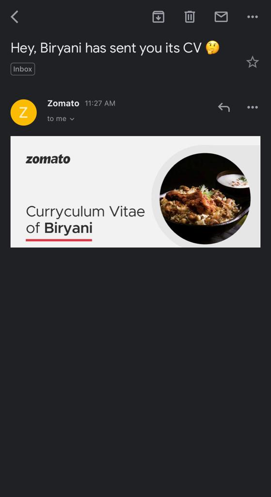

# Zomato-Biryani
Biryani had sent me her CV via. Zomato India to my email ID.
I thought why not to take this to the next level.

# Here is the CV they have sent to me via. email.

# Since, i am someone who follows structured approach.I created a dummy bot for the screening questions.

Here is the fun part : https://bit.ly/Craving_Executive_Officer
